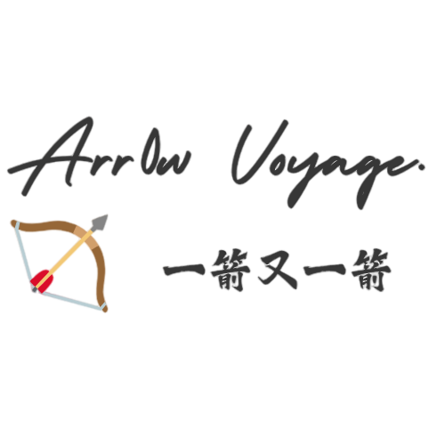
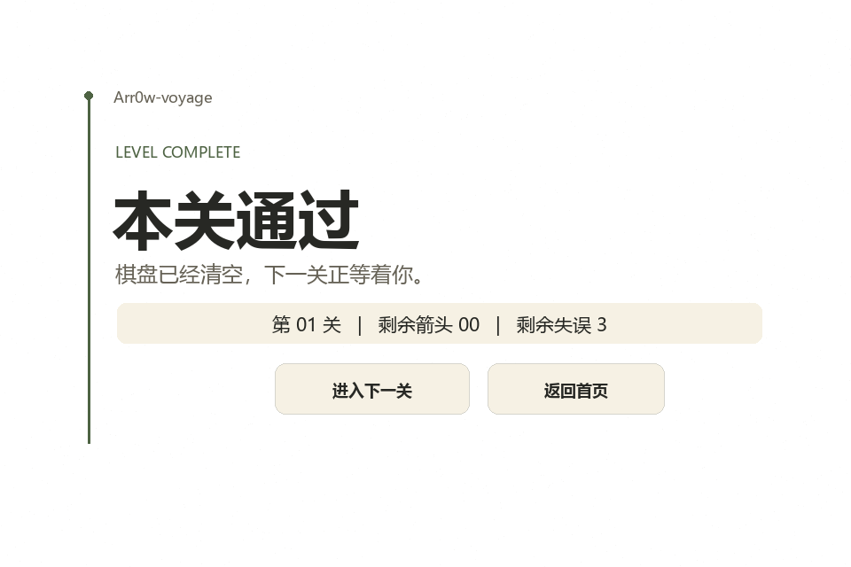
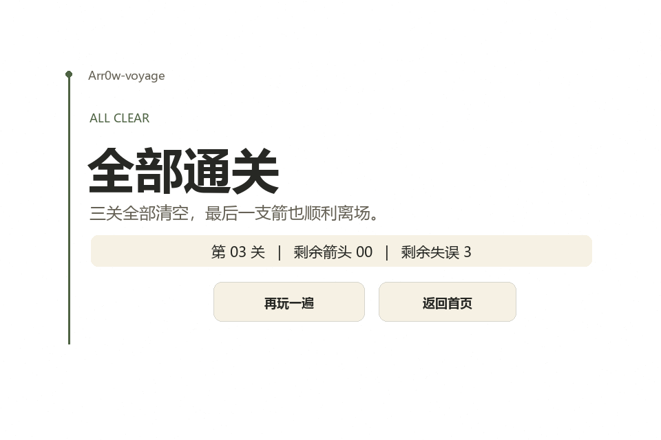
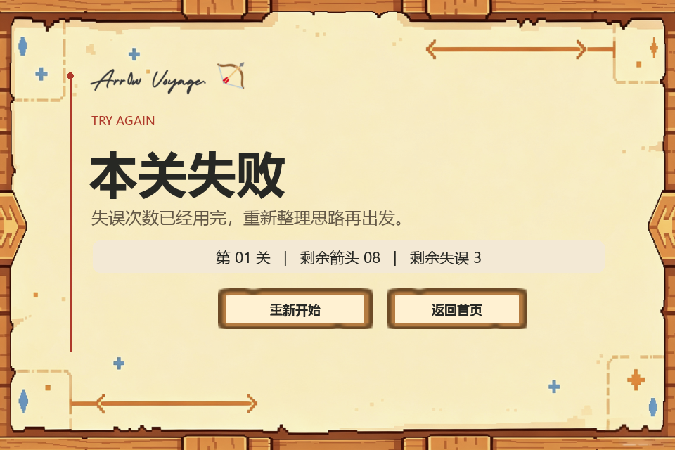
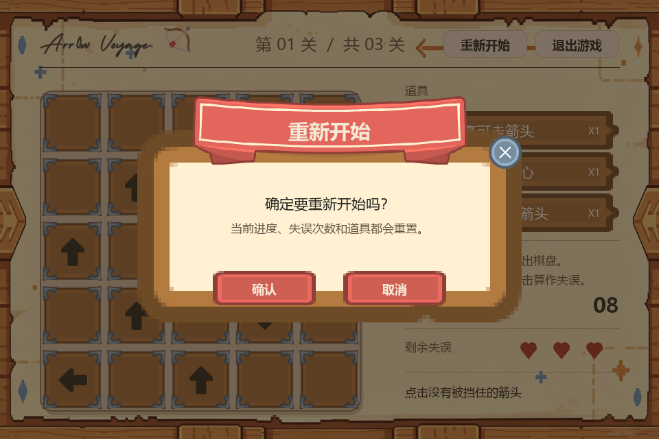
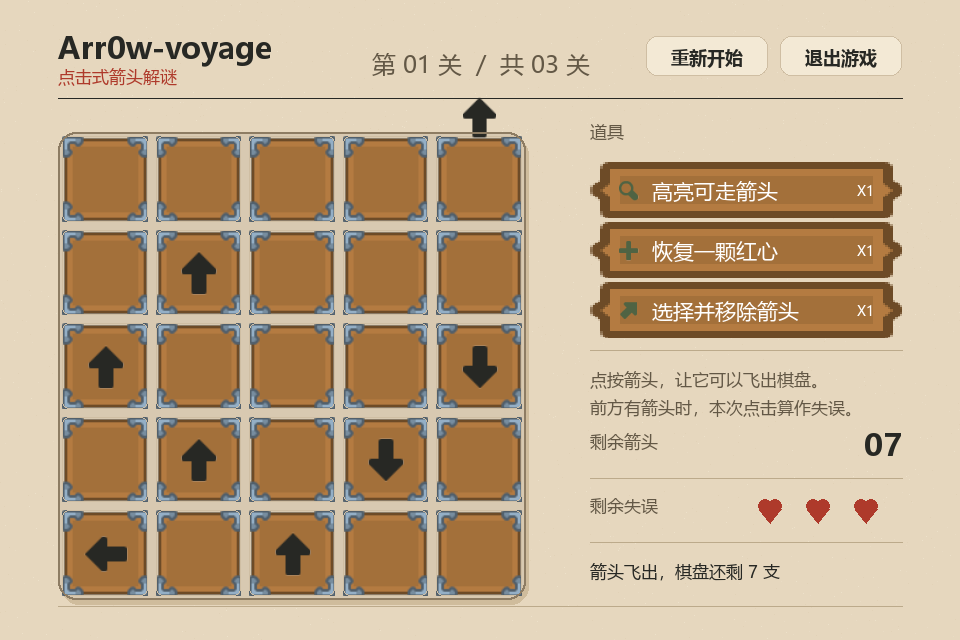

<div align="center">
  

  <h1>Arr0w Voyage</h1>

  <p><strong>一箭又一箭</strong> · 观察方向，规划顺序，清空棋盘</p>

  <p>
    <a href="https://www.python.org/"></a>
    <a href="https://www.pygame.org/"></a>
    <a href="https://github.com/Clu3y/Arr0w-voyage/releases/download/v1.0.0/Arr0wVoyage.exe"></a>
    <a href="https://github.com/Clu3y/Arr0w-voyage"></a>
  </p>

  <p>
    <a href="#项目简介">项目简介</a> ·
    <a href="#快速开始">快速开始</a> ·
    <a href="#玩法与操作">玩法与操作</a> ·
    <a href="#关卡设计">关卡设计</a> ·
    <a href="#界面预览">界面预览</a> ·
    <a href="#项目结构">项目结构</a> ·
    <a href="#开发与测试">开发与测试</a>
  </p>
</div>

<p align="center">
  
</p>

<p align="center"><sub>点击箭头，判断路径，让所有箭头依次飞出棋盘。</sub></p>

---

## 项目简介

**Arr0w Voyage** 是一款使用 **Python + Pygame** 开发的点击式箭头解谜小游戏。棋盘由上、下、左、右四种方向的箭头组成，玩家需要找出正确的点击顺序，在不耗尽失误次数的情况下清空所有箭头。

| 亮点 | 说明 |
| :--- | :--- |
| 简单直观 | 点击箭头即可判断它能否飞向棋盘外，无需复杂操作 |
| 三关流程 | 内置 3 个可通关关卡，棋盘规模和依赖关系逐级增加 |
| 即时反馈 | 包含飞出动画、碰撞晃动、变色、音效和 Toast 提示 |
| 道具系统 | 提供提示、恢复失误次数和移出箭头三种一次性道具 |
| 自定义模式 | 可设置 1~10 的 N×N 棋盘、道具次数和空位比例 |
| 完整工程化 | 模块拆分、pytest 自动化测试、测试报告和 AIGC 开发记录 |

## 快速开始

### 方式一：下载即可玩（Windows）

> [!TIP]
> 不想配置 Python 环境，可以直接下载已经打包好的可执行文件。

**[下载 Arr0wVoyage.exe](https://github.com/Clu3y/Arr0w-voyage/releases/download/v1.1.0/Arr0wVoyage.exe)**

下载后双击 `Arr0wVoyage.exe` 即可运行，无需额外安装 Python 或依赖库。

### 方式二：从源码运行

#### Windows PowerShell

```powershell
git clone https://github.com/Clu3y/Arr0w-voyage.git
cd Arr0w-voyage

python -m venv .venv
.\.venv\Scripts\python.exe -m pip install -r requirements.txt
.\.venv\Scripts\python.exe main.py
```

如果系统没有配置 `python` 命令，请改用本机 Python 3.12 的完整路径。

### 开发环境

| 工具 | 建议版本 |
| :--- | :--- |
| Python | 3.12 |
| Pygame | 2.6+ |
| pytest | 8+ |

## 玩法与操作

玩家需要按照正确顺序点击箭头。箭头前方没有其他箭头时，它会飞离棋盘；如果路径被阻挡，箭头会给出碰撞反馈并消耗一次失误机会。清空当前关卡全部箭头即可进入下一关。

### 操作说明

| 操作 | 功能 |
| :--- | :--- |
| 鼠标左键 | 点击箭头，判断该箭头能否飞出棋盘 |
| 提示 | 高亮一个当前可直接飞出的箭头，普通模式下共可使用一次 |
| 增加失误次数 | 恢复一颗已失去的红心，满血时不可使用 |
| 移出 | 先点击“移出”，再点击要移除的箭头 |
| 重新开始 | 回到第一关，并恢复棋盘、红心和道具状态 |
| 退出游戏 | 点击右上角“退出游戏”按钮 |
| `Esc` | 自定义配置页或游戏内返回开始界面；在开始界面再次按下可退出 |

### 游戏规则

- 无阻挡的箭头会沿当前方向播放飞出动画，随后从棋盘消失。
- 被阻挡的箭头不会消失，并会通过晃动、变色和音效提示玩家。
- 普通模式共有 3 次失误机会，失误次数会在三个关卡之间保留。
- 普通模式下，提示、增加失误次数和移出三种道具各可使用一次。
- 自定义模式支持 1~10 的 N×N 棋盘、三类道具各 0~9 次，以及用于控制空位置比例的难度系数。

## 关卡设计

| 关卡 | 棋盘 | 箭头数量 | 难度说明 |
| :--- | :---: | :---: | :--- |
| 第一关 | 5×5 | 8 | 熟悉点击、方向和阻挡规则 |
| 第二关 | 5×5 | 20 | 棋盘占用率达到 80%，依赖关系增加 |
| 第三关 | 6×6 | 36 | 全部格子铺满箭头，需要完整规划顺序 |

## 界面预览

<table>
  <tr>
    <td width="50%">
      
      <p align="center"><sub>开始界面</sub></p>
    </td>
    <td width="50%">
      
      <p align="center"><sub>游戏界面</sub></p>
    </td>
  </tr>
  <tr>
    <td width="50%">
      
      <p align="center"><sub>本关通过</sub></p>
    </td>
    <td width="50%">
      
      <p align="center"><sub>全部通关</sub></p>
    </td>
  </tr>
</table>

### 更多截图

失败、动画与确认弹窗：

<table>
  <tr>
    <td width="50%">
      
      <p align="center"><sub>本关失败</sub></p>
    </td>
    <td width="50%">
      
      <p align="center"><sub>重新开始确认</sub></p>
    </td>
  </tr>
  <tr>
    <td width="50%">
      
      <p align="center"><sub>退出游戏确认</sub></p>
    </td>
    <td width="50%">
      
      <p align="center"><sub>箭头飞出动画</sub></p>
    </td>
  </tr>
</table>

## 核心实现

### 路径判断

每种方向会被映射为行列偏移量，例如 `UP = (-1, 0)`、`RIGHT = (0, 1)`。判断时从当前箭头所在格出发，沿指定方向逐格扫描：

- 扫描越界前没有遇到其他箭头，说明该箭头可以直接飞出；
- 扫描过程中遇到任意非空单元格，说明路径被阻挡；
- 路径判断与 Pygame 绘制逻辑分离，便于使用 pytest 进行纯逻辑测试。

```text
→  ·  ↑  ·    → 前方被 ↑ 阻挡

→  ·  ·  ·    → 前方无阻挡，可以飞出
```

### 模块拆分

项目将游戏状态、界面组件、纯路径逻辑、动画、音频和道具状态分别放在不同模块中，避免所有功能集中在单一文件内。关卡布局则通过“反向放置、正序可解”的方式生成，保证每个内置关卡都存在合理的通关顺序。

## 项目结构

```text
arrow-game/
├─ main.py                 # 程序入口
├─ game.py                 # 游戏主循环、状态与流程管理
├─ custom_mode.py          # 自定义配置、滑块与随机棋盘生成
├─ ui.py                   # 界面组件
├─ tools.py                # 道具定义与剩余次数状态
├─ animations.py           # 飞出、碰撞、提示与 Toast 状态
├─ audio.py                # 背景音乐与音效管理
├─ logic.py                # 路径检测等纯逻辑
├─ levels.py               # 内置关卡数据
├─ tests/                  # pytest 自动化测试
├─ assets/                 # 图片、界面和音频资源
│  ├─ ui/                  # 箭头、道具、方格和 Logo
│  ├─ background/          # 背景、按钮和提示框素材
│  └─ audio/               # 音效与背景音乐
├─ screenshots/            # 演示截图
├─ docs/                   # AIGC、测试、PSP 等材料
├─ requirements.txt
└─ README.md
```

## 素材来源

- 音效与界面素材来自 [Kenney](https://kenney.nl/)，均为 CC0 素材。
- 背景音乐来自 [OpenGameArt](https://opengameart.org/)，为 CC0 素材。
- 详细音频用途与来源见 [音频素材来源](docs/audio-credits.md)。

| 音效 | 用途 |
| :--- | :--- |
| `click.ogg` | 鼠标进入可交互按钮时播放 |
| `fly.ogg` | 箭头成功飞出时播放 |
| `miss.ogg` | 箭头被阻挡并消耗失误次数时播放 |
| `win.ogg` | 本关通过或全部通关时播放 |
| `fail.ogg` | 失误次数耗尽时播放 |
| `bgm.ogg` | 开始界面和游戏中循环播放 |

---

<div align="center">
  <p><strong>Arr0w Voyage · 一箭又一箭</strong></p>
  <p><sub>Made with Python & Pygame · 2026</sub></p>
  <p><a href="https://github.com/Clu3y/Arr0w-voyage">GitHub 仓库</a> · <a href="https://github.com/Clu3y/Arr0w-voyage/releases">Release 下载</a></p>
</div>
