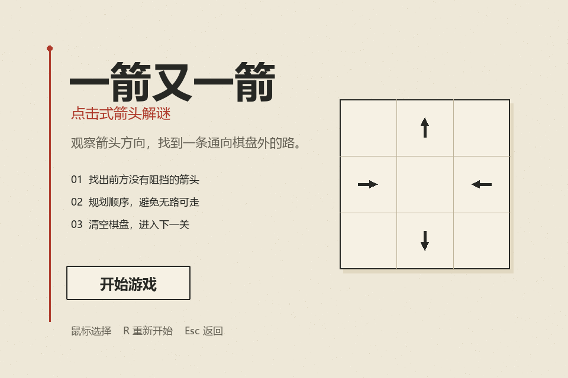
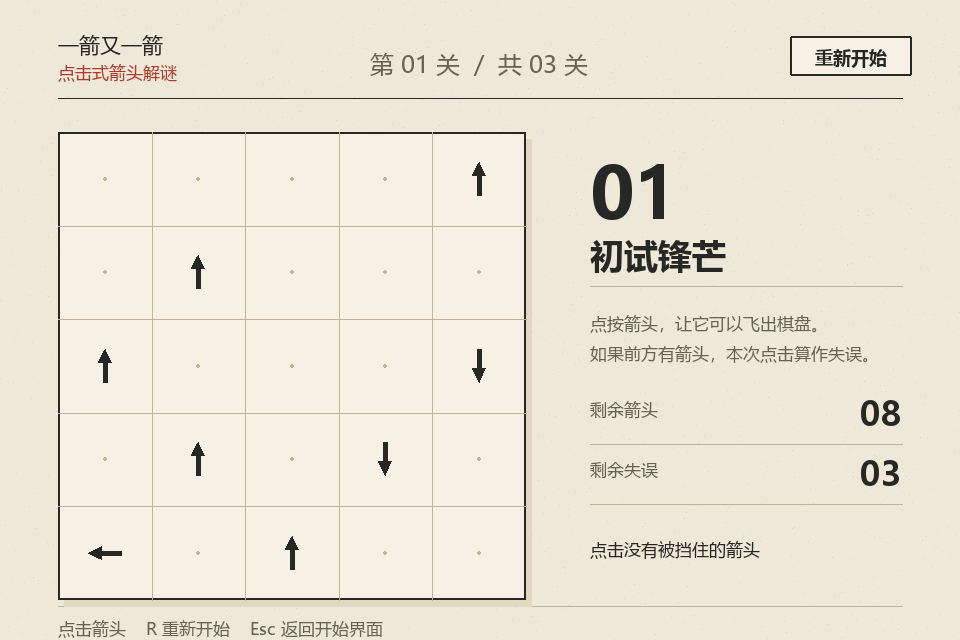

# Arr0w Voyage（一箭又一箭）

使用 Python 和 Pygame 开发的点击式箭头解谜小游戏。玩家需要按照正确顺序点击箭头，使所有箭头飞出棋盘。

> 当前状态：开始界面、游戏棋盘和基础点击消除已完成，动画与关卡流程正在开发中。

## 开发环境

- Python 3.12
- Pygame 2.6+
- pytest 8+

## 安装与运行

推荐在 Windows PowerShell 中执行：

```powershell
cd D:\ASSIGNMENT\软件工程\第二次作业\arrow-game
python -m venv .venv
.\.venv\Scripts\python.exe -m pip install -r requirements.txt
.\.venv\Scripts\python.exe main.py
```

如果系统没有配置 `python` 命令，请使用本机 Python 3.12 的实际安装路径。

## 运行测试

```powershell
.\.venv\Scripts\python.exe -m pytest
```

## 游戏操作

- 鼠标左键：点击箭头，判断它能否飞出棋盘
- R：重新开始当前关卡
- Esc：返回开始界面；在开始界面再次按下可退出游戏

## 项目结构

```text
arrow-game/
├─ main.py                 # 程序入口
├─ game.py                 # 游戏主循环与状态管理
├─ ui.py                   # 纸张风格界面组件
├─ logic.py                # 路径检测等纯逻辑
├─ levels.py               # 关卡数据
├─ tests/                  # 自动化测试
├─ assets/                 # 图片和音效资源
├─ docs/                   # AIGC、测试、PSP 和博客材料
├─ screenshots/            # 演示截图
├─ requirements.txt
└─ README.md
```

## 游戏截图

### 开始界面



### 游戏界面



通关或失败界面完成后继续在此处补充。

## 仓库

GitHub：<https://github.com/Clu3y/Arr0w-voyage>
