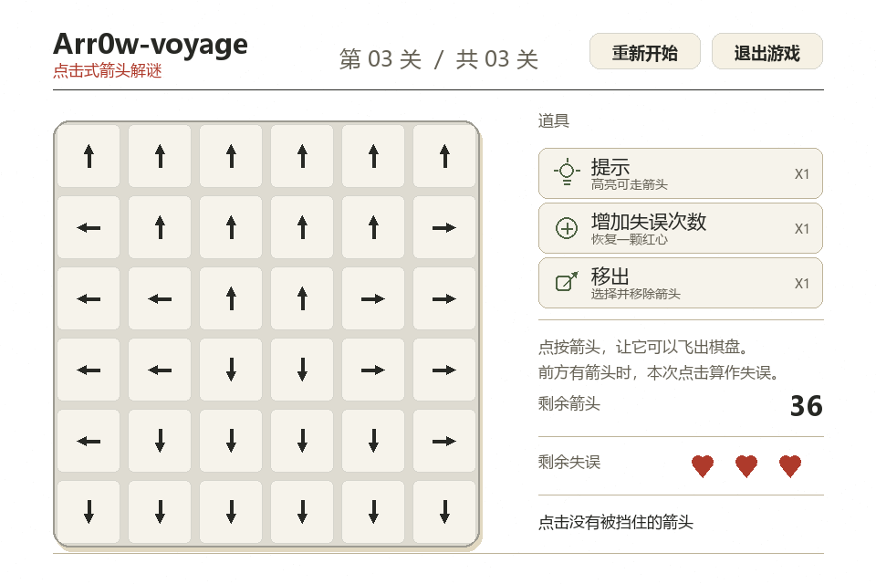

# Arr0w Voyage（一箭又一箭）

使用 Python 和 Pygame 开发的点击式箭头解谜小游戏。玩家需要按照正确顺序点击箭头，使所有箭头飞出棋盘。

> 当前状态：开始界面、三关完整流程、通关与失败结果页、道具机制、箭头飞出动画、碰撞反馈和音乐音效均已完成，当前正在完善提交材料。

## 开发环境

- Python 3.12
- Pygame 2.6+
- pytest 8+

## 安装与运行

推荐在 Windows PowerShell 中执行：

```powershell
cd D:\ASSIGNMENT\软件工程\第二次作业\arrow-game
python -m venv .venv
.\.venv\Scripts\python.exe -m pip install -r requirements.txt
.\.venv\Scripts\python.exe main.py
```

如果系统没有配置 `python` 命令，请使用本机 Python 3.12 的实际安装路径。

## 运行测试

```powershell
.\.venv\Scripts\python.exe -m pytest
```

## 游戏操作

- 鼠标左键：点击箭头，判断它能否飞出棋盘
- 飞出与碰撞：无阻挡箭头会飞离棋盘；被阻挡箭头会晃动、变色并消耗一次失误
- 提示：三关合计一次，高亮一个可直接飞出的箭头
- 增加失误次数：三关合计一次，恢复一颗已失去的红心；满血时不可用
- 移出：三关合计一次，先点击“移出”，再点击要移除的箭头
- 重新开始：回到第一关，并恢复棋盘、红心和三个道具
- 失误次数：进入下一关时继续保留，三关共享 3 次失误机会
- 退出游戏：点击右上角“退出游戏”按钮
- Esc：返回开始界面；在开始界面再次按下可退出游戏

## 音效与背景音乐

- `click.ogg`：鼠标进入可交互按钮时播放，鼠标点击本身不播放
- `fly.ogg`：箭头成功飞出时播放
- `miss.ogg`：箭头被阻挡并消耗失误次数时播放
- `win.ogg`：本关通过或全部通关时播放
- `fail.ogg`：失误次数耗尽时播放
- `bgm.ogg`：开始界面和游戏中循环播放，进入下一关时不会中断

音效来自 [Kenney](https://kenney.nl/)，背景音乐来自 [OpenGameArt](https://opengameart.org/)，均为 CC0 素材。详细记录见 `docs/audio-credits.md`。

## 关卡设计

| 关卡 | 棋盘 | 箭头数量 | 难度说明 |
| :--- | :---: | :---: | :--- |
| 第一关·初试锋芒 | 5×5 | 8 | 熟悉点击和阻挡规则 |
| 第二关·层层相扣 | 5×5 | 20 | 棋盘占用率达到 80% |
| 第三关·最后一箭 | 6×6 | 36 | 全部格子铺满箭头 |

## 项目结构

```text
arrow-game/
├─ main.py                 # 程序入口
├─ game.py                 # 游戏主循环与状态管理
├─ ui.py                   # 纸张风格界面组件
├─ tools.py                # 道具定义与一次性状态
├─ animations.py           # 飞出动画、碰撞、提示和 Toast 状态
├─ audio.py                # 背景音乐与音效管理
├─ logic.py                # 路径检测等纯逻辑
├─ levels.py               # 关卡数据
├─ tests/                  # 自动化测试
├─ assets/                 # 图片和音效资源
├─ docs/                   # AIGC、测试、PSP 和博客材料
├─ screenshots/            # 演示截图
├─ requirements.txt
└─ README.md
```

## 游戏截图

### 开始界面


### 游戏界面


### 箭头飞出动画


### 第三关



### 本关通过


### 全部通关


### 本关失败


## 仓库

GitHub：<https://github.com/Clu3y/Arr0w-voyage>
